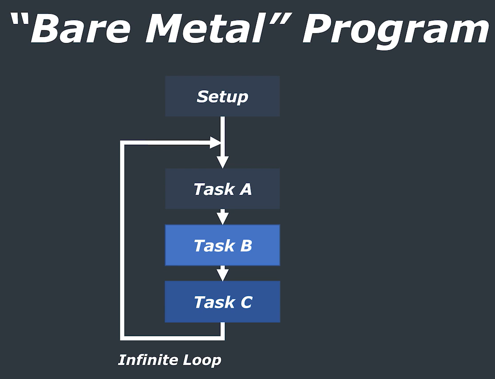
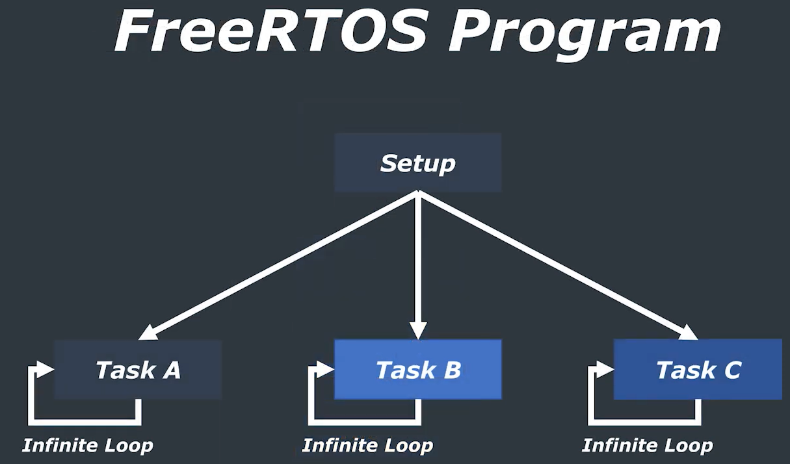
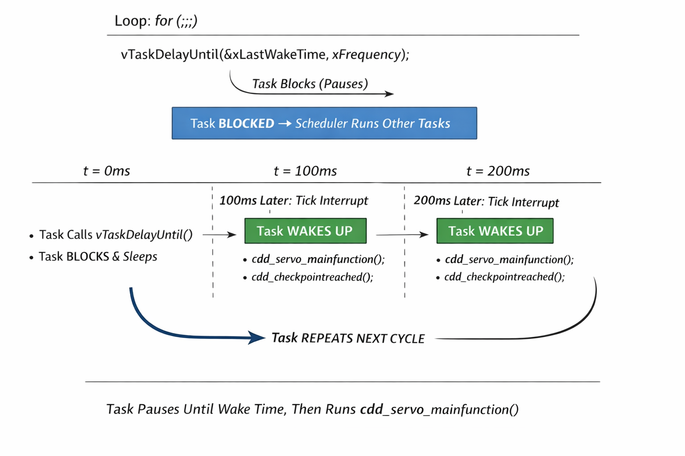

# FreeRTOS scheduling
## Bare metal or SuperLoop

Executing Task after task by consuming lowest memory and resources.

## RTOS Scheduling

Tasks will execute concurrently by taking large amount of resources compared to BareMetal.

# RTOS Task Creation Guide

# 1. Define the Task Table Size

## File: `Os.h`

Set the total number of tasks in the system:

``` c
#define TASK_TABLE_SIZE     (4u)
```

### Explanation

-   This macro defines the total number of tasks that will be created.
-   The value must match the number of entries in the task table in
    `Os.c`.
-   If you add or remove tasks, update this value accordingly.

------------------------------------------------------------------------

# 2. Configure Task Properties

## File: `Os.c`

Define all task properties inside the task table:

``` c
/* --- TASK TABLE --- */
const OS_TaskEntry task_table[TASK_TABLE_SIZE] = {
    /* Task entries: { task function, name, stack depth, parameters, priority, core affinity } */
    { asw_task_100ms,   "ASW_Task",     256, NULL, 2, OS_CORE_0 },
    { cdd_task_100ms,   "CDD_Task",     256, NULL, 2, OS_CORE_0 },
    { sys_task_100ms,   "SYS_Task",     256, NULL, 2, OS_CORE_1 }, 
    { Test_task_100ms,  "Test_Task",    256, NULL, 2, OS_CORE_0 },
};
```

## Task Table Fields Explained
```
  Field           Description
  --------------- -------------------------------------------
  Task Function   Entry function of the task
  Name            Task name (used for debugging)
  Stack Depth     Stack size (in words, not bytes)
  Parameters      Optional argument pointer (NULL if unused)
  Priority        FreeRTOS task priority
  Core Affinity   Target CPU core (for multicore systems)
```
--------------------------------------------------------------

# 3. Create a Periodic Task

Go to the appropriate `rte_coreX.c` file depending on the configured
core affinity.

To create a periodic task:

1.  Convert milliseconds to ticks using `pdMS_TO_TICKS()`.
2.  Store the last wake time using `xTaskGetTickCount()`.
3.  Use `vTaskDelayUntil()` to maintain precise periodic execution.

## Example: 100ms Periodic Task

``` c
void cdd_task_100ms(void *pvParameters)
{
    (void)pvParameters;

    const TickType_t xFrequency = pdMS_TO_TICKS(100);
    TickType_t xLastWakeTime = xTaskGetTickCount();

    for (;;)
    {
        vTaskDelayUntil(&xLastWakeTime, xFrequency);

        cdd_servo_mainfunction();
        cdd_checkpointreached();
    }
}
```

------------------------------------------------------------------------

# Why `vTaskDelay()` Is Not Used

`vTaskDelay()` creates a relative delay.

Example:

Execution Time + Delay Time

If execution time is 5 ms and delay is 100 ms:

Actual period becomes 105 ms.

Over time, this causes time drift.

------------------------------------------------------------------------

# Why `vTaskDelayUntil()` Is Recommended

`vTaskDelayUntil()` provides absolute periodic timing.

It wakes the task at:

LastWakeTime + Period

This ensures: - No timing drift - Stable and deterministic scheduling -
Fixed periodic execution - Alignment with system tick

------------------------------------------------------------------------

# How an Infinite Loop Task Works in FreeRTOS
# Example Task

``` c
void cdd_task_100ms(void *pvParameters)
{
    (void)pvParameters;

    const TickType_t xFrequency = pdMS_TO_TICKS(100);
    TickType_t xLastWakeTime = xTaskGetTickCount();

    for (;;)
    {
        vTaskDelayUntil(&xLastWakeTime, xFrequency);

        cdd_servo_mainfunction();
        cdd_checkpointreached();
    }
}
```

------------------------------------------------------------------------

# Does the Infinite Loop Ever Break?

No.

The `for(;;)` loop never exits.\
Instead, the task is paused and resumed by the scheduler.

The loop remains active for the lifetime of the task.

------------------------------------------------------------------------

# How Scheduling Actually Works

## Step 1: Task Starts Running

-   The scheduler selects the highest-priority READY task.
-   The task begins executing from the top of the loop.

------------------------------------------------------------------------

## Step 2: `vTaskDelayUntil()` Is Called

When this function executes:

1.  FreeRTOS calculates the next wake-up time.
2.  The task state changes:

`RUNNING → BLOCKED`

3.  The task is placed in the delayed list.
4.  The scheduler immediately runs.

------------------------------------------------------------------------

## Step 3: Scheduler Selects Another Task

Since the current task is `BLOCKED`:

-   The scheduler selects the next highest-priority READY task.
-   That task begins running.

If no other tasks are READY, the `Idle task` runs.

------------------------------------------------------------------------

## Step 4: System Tick Interrupt

At every system tick (for example, every 1ms):

-   The tick interrupt executes.
-   FreeRTOS checks delayed tasks.
-   If delay time has expired:

`BLOCKED → READY`

If the task has higher priority than the currently running task:

-   A context switch occurs.
-   The task resumes execution.

------------------------------------------------------------------------

# Important Concept: Context Switching

When a task blocks:

-   CPU registers are saved.
-   Stack pointer is stored.
-   Execution context is preserved.

When resumed:

-   Registers are restored.
-   Execution continues from the exact next instruction.

The loop does not restart. It continues where it left off.

------------------------------------------------------------------------

# What If No Delay Is Used?

Example:

``` c
for (;;)
{
    cdd_servo_mainfunction();
}
```

If this task has the highest priority:

-   It never blocks.
-   Other tasks never run.
-   CPU is fully occupied.
-   System appears frozen.

This is why blocking APIs are required in RTOS tasks.

------------------------------------------------------------------------

# Two Ways a Task Stops Running

A task stops executing only if:

1.  It enters a `BLOCKED state` (delay, semaphore, queue, notification,
    etc.)
2.  A higher-priority task becomes `READY (preemption)`

Otherwise, it keeps running.

------------------------------------------------------------------------

# Visual Timeline Example (100ms Task)
```
t = 0ms Task starts
t = 1ms Calls vTaskDelayUntil()
Task becomes BLOCKED
Scheduler switches task
t = 100ms Tick interrupt
Task becomes READY
Scheduler restores task
t = 100ms Task continues execution
```
The loop never exits --- execution is paused and resumed.

------------------------------------------------------------------------

