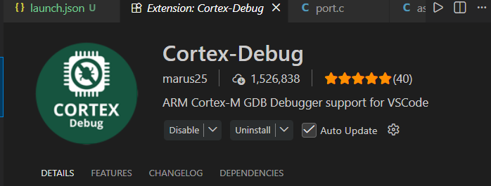
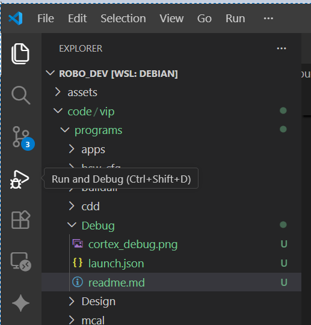

# RP2040 Debug Setup Guide

This project uses:
- RP2040
- OpenOCD
- VSCode Cortex-Debug
- Windows Debug Environment
- ELF built from Linux/WSL

---

# Folder Structure

```text
/debug
    launch.json
```

The `launch.json` file contains the VSCode debug configuration.

---

# Requirements

Install:

## 1. VSCode

## 2. Cortex-Debug Extension



---

## 3. OpenOCD

Used for RP2040 SWD debugging.

Take from (openocd + GNU) -> https://drive.google.com/file/d/1hG0MDZaubLJ1J49WHf2FBdOTlIXrpw3Z/view?usp=sharing

---

## 4. ARM GNU Toolchain

Take from (openocd + GNU) -> https://drive.google.com/file/d/1hG0MDZaubLJ1J49WHf2FBdOTlIXrpw3Z/view?usp=sharing

---

# Hardware

Connect:
- RP2040 Debug Probe

Using SWD:
- SWCLK
- SWDIO
- GND

---

# launch.json Usage

The debug configuration assumes, eg path: (please copy the repo to your C:\ after build and replace the below path)

```text
C:/Users/jarvis/Documents/Robo/may3/Robo_dev
```

contains the repository.

---

# Important Path Translation

The ELF was built in Linux/WSL.

ELF contains source paths like:

```text
/home/friday/rtos_pico/may3/Robo_dev
```

Windows cannot open these paths directly.

This command translates Linux paths to Windows paths:

```json
"preLaunchCommands": [
    "set substitute-path /home/friday/rtos_pico/may3/Robo_dev C:/Users/jarvis/Documents/Robo/may3/Robo_dev"
]
```

Note: Please ensure whether this line presents in json file.
---

# How To Start Debugging

## 1. Open repo in VSCode

```text
File -> Open Folder
```

Open:

```text
C:/Users/jarvis/Documents/Robo/may3/Robo_dev
```

---

## 2. Connect RP2040 Debug Probe

Connect:
- USB debug probe
- SWD wires

---

## 3. Open Debug Panel

Press:

```text
Ctrl + Shift + D
```
or 


---

## 4. Start Debugging

Select:

```text
RP2040 Debug
```

Press:
- F5 or (ctrl + fn + f5)

---

# Useful Debug Commands

## Read Registers

```gdb
info registers
```

---

## Read RAM

```gdb
x/4wx 0x20000000
```

---

## Read Boolean Variable By Address

```gdb
p *(bool*)0x20002d4c
```

---

## Continue Execution

```gdb
continue
```

---

## Reset Target

```gdb
monitor reset init
```

---

## Break at Main

```gdb
break main
```

---

# Dump RAM

Dump full SRAM:

```gdb
dump binary memory ram_dump.bin 0x20000000 0x20042000
```

---

# Common Problems

## 1. Source File Not Found

Fix:
- ensure substitute-path exists in launch.json

---

## 2. USB Code 43

Usually:
- bad firmware
- bad USB cable
- USB stack crash

Test:
- hold BOOTSEL while plugging USB

---

## 3. OpenOCD Already Running

Kill existing process:

```powershell
taskkill /IM openocd.exe /F
```

---

# Git Usage

The `/debug` folder is committed intentionally.

After fresh clone:

```bash
git clone <repo>
```

the debug setup will already exist.

---

# Recommended Workflow

| Tool | Purpose |
|---|---|
| VSCode | Source Debugging |
| OpenOCD | SWD Server |
| GDB | Low-level Debug |
| PuTTY | UART Logs |
| Cortex-Debug | VSCode Integration |

---

# Important Notes

- ELF built in Linux can still debug in Windows
- substitute-path is required
- Use absolute Windows paths
- Use forward slashes `/`

Example:

```text
C:/Users/jarvis/Documents/Robo/may3/Robo_dev
```

NOT:

```text
C:\Users\jarvis\Documents\Robo
```

---

# Clean Exit

Stop debugging:

```text
Shift + F5
```

Or in GDB:

```gdb
monitor shutdown
```

---

# Useful RP2040 Memory Addresses

| Region | Address |
|---|---|
| Flash | 0x10000000 |
| SRAM | 0x20000000 |
| GPIO Registers | 0x40014000 |
| UART0 Registers | 0x40034000 |

---